# Project 1 Planning: The Unofficial Guide

> Write this document before you write any pipeline code.
> Your spec and architecture diagram are what you'll use to direct AI tools (Claude, Copilot, etc.) to generate your implementation — the more specific they are, the more useful the generated code will be.
> Update the Retrieval Approach and Chunking Strategy sections if you change your approach during implementation.
> Update this file before starting any stretch features.

---

## Domain

<!-- What domain did you choose? Why is this knowledge valuable and hard to find through official channels? -->

> * I chose the domain "Unofficial Guide to Admissions, Course Strategy, and Burnout Management for Georgia Tech's OMSCS". 
> 
> * This knowledge is incredibly difficult for prospective and current students to track down because official Georgia Tech pages only provide high-level academic requirements, whereas the real strategies for 
> survival—such as tracking historical class workloads, understanding pairing combinations to prevent burnout while working full-time, and decoding the strict foundational course requirements—are buried across 
> thousands of scattered forum reviews and multi-year Reddit threads.
---

## Documents

<!-- List your specific sources: URLs, subreddit names, forum threads, or file descriptions.
     Aim for at least 10 sources that together cover different subtopics or perspectives within your domain. -->

| # | Source | Description | URL or location |
|---|--------|-------------|-----------------|
| 1 | OMSHub Data Archive | Raw static catalog, tracking metadata, historical workload hours, and program constraints. | `https://github.com/omshub/data/tree/main/static` |
| 2 | Reddit Thread: Foundational Requirement | Student thread clarifying the reality of first-year rules and leniency regarding the "2 Bs in 12 months" policy. | `https://www.reddit.com/r/OMSCS/comments/1fskt68/foundational_course_requirement/` |
| 3 | Unofficial Orientation Guide FAQ | The official r/OMSCS Wiki serving as a hub for student-curated advice, track preparation, and administrative hacks. | `https://www.reddit.com/r/OMSCS/wiki/index/` |
| 4 | Reddit Thread: Comprehensive Data Review | Deep-dive individual retrospective review tracking a massive amount of personal data, metrics, and course thoughts. | `https://www.reddit.com/r/OMSCS/comments/12nh421/my_waytoomuch_data_omscs_review/` |
| 5 | Reddit Thread: 10-Class Journey Trip | A complete student retrospective reflecting on their path through all 10 courses to graduate the program. | `https://www.reddit.com/r/OMSCS/comments/12k57x1/finished_my_10th_class_my_trip_through_omscs/` |
| 6 | Reddit Thread: Computing Systems Track Review | Graduate review evaluating specific course selections and project difficulties within the Core Systems track. | `https://www.reddit.com/r/OMSCS/comments/12zn0ha/yet_another_omscs_review_computing_systems_track/` |
| 7 | Reddit Thread: Incompatible Class Pairings | Classic community advice thread mapping out which heavy-workload courses should never be paired together. | `https://www.reddit.com/r/OMSCS/comments/3qyup9/classes_not_to_take_together_and_classes_that_are/` |
| 8 | Reddit Comment: Pairing Deep-Dive Context | A high-value specific comment nested within course selection threads providing actionable pairing frameworks. | `https://www.reddit.com/r/OMSCS/comments/3rghng/comment/cwo0wqu/` |
| 9 | Reddit Megathread: Admissions Results & Chances | Crowdsourced repository of real applicant stats (GPA, background, prerequisites) and their acceptance outcomes. | `https://www.reddit.com/r/OMSCS/comments/1pyef6c/admissions_megathread_results_chances_and/` |
| 10 | Reddit Megathread: Course Specs & Capacity Logistics | Comprehensive thread tracking course selection strategies, registration dynamics, and capacity limitations. | `https://www.reddit.com/r/OMSCS/comments/1pyef5z/course_specs_megathread_selection_choices/` |
| 11 | Reddit Thread: 2025 Difficulty Rankings | Quantitative community leaderboard ranking all program courses by difficulty and weekly hours. | `https://www.reddit.com/r/OMSCS/comments/1hsbc76/all_courses_ranked_by_difficulty_2025_springfall/` |
| 12 | GT Computing Systems Spec | Official academic checklist tracking foundational choices and electives for the Core Systems specialization. | `https://omscs.gatech.edu/specialization-computing-systems` |
| 13 | GT Machine Learning Spec | Official curriculum, core courses, and elective options for the popular Machine Learning specialization. | `https://omscs.gatech.edu/specialization-machine-learning` |
| 14 | GT Artificial Intelligence Spec | Official requirements for the AI track (formerly known as Interactive Intelligence). | `https://omscs.gatech.edu/specialization-artificial-intelligence-formerly-interactive-intelligence` |
| 15 | GT Computational Perception & Robotics Spec | Official curriculum mapping for the intersection of computer vision, robotics, and physical systems. | `https://omscs.gatech.edu/specialization-computational-perception-and-robotics` |
| 16 | GT Computer Graphics Spec | Official academic guidelines and prerequisite tracks for the Computer Graphics specialization. | `https://omscs.gatech.edu/specialization-computer-graphics` |
| 17 | GT Human-Computer Interaction Spec | Official tracking sheet detailing requirements for interface design, evaluation, and user experience courses. | `https://omscs.gatech.edu/specialization-human-computer-interaction` |
| 18 | GT Research Opportunities Portal | Official institutional framework explaining how online students can pursue formal research (CS 6999). | `https://omscs.gatech.edu/research-opportunities` |
| 19 | GT Preparing Yourself for OMSCS | Official self-assessment page recommending specific mathematical foundations and programming competencies. | `https://omscs.gatech.edu/preparing-yourself-omscs` |
| 20 | GT Prospective Student FAQs | Official baseline information covering technical setup requirements, degree legitimacy, and proctoring. | `https://omscs.gatech.edu/prospective-student-faqs` |
| 21 | Academic Standing Regulations | Georgia Tech Registrar policy text (Rule 6) detailing rules on academic standing and transcript marks. | `https://catalog.gatech.edu/rules/6/` |
| 22 | GT Admission Criteria | Official baseline documentation for GPA minimums, academic background requirements, and documentation rules. | `https://omscs.gatech.edu/admission-criteria` |
| 23 | GT Application Deadlines & Guidelines | Official calendar timelines, letter of recommendation instructions, and portfolio requirements. | `https://omscs.gatech.edu/deadlines-decisions-requirements-and-guidelines` |
| 24 | GT Overall Degree Requirements | Institutional checklist for graduation: 30 credit hours, GPA floors, and core vs. elective splits. | `https://omscs.gatech.edu/degree-requirements` |
| 25 | GT Current Course Catalog | Official active inventory of courses currently being offered to online students in the active semester. | `https://omscs.gatech.edu/current-courses` |
---

## Chunking Strategy

<!-- How will you split documents into chunks?
     State your chunk size (in tokens or characters), overlap size, and explain why those
     numbers fit the structure of your documents.
     A review-heavy corpus warrants different chunking than a long FAQ. -->

**Chunk size:** 300 tokens max (via recursive splitting)

**Overlap:** 50 tokens

**Separators:** `["\n\n", "\n", ". ", " "]` (paragraph → line → sentence → word)

**Reasoning:**
Use `RecursiveCharacterTextSplitter` for all documents. This approach:
- Respects natural boundaries (paragraphs, sentences) rather than cutting arbitrarily at fixed token count
- Produces variable-size chunks (80–300 tokens) that reflect content structure
- Keeps advice blocks and policy statements together instead of splitting mid-thought
- Still simple: one splitter, no routing logic, no per-document-type complexity

**Chunk variance is intentional** — a 100-token chunk means a complete thought wrapped up. A 280-token chunk means a big advice block. This structure will be visible in retrieval logs and helps with debugging. If something breaks, the log will show "oh, this advice got split across two chunks at a paragraph boundary" rather than "some random token-count boundary."

---

## Retrieval Approach

<!-- Which embedding model are you using (e.g., all-MiniLM-L6-v2 via sentence-transformers)?
     How many chunks will you retrieve per query (top-k)?
     If you were deploying this for real users and cost wasn't a constraint, what tradeoffs
     would you weigh in choosing a different embedding model — context length, multilingual
     support, accuracy on domain-specific text, latency? -->

**Embedding model:** all-MiniLM-L6-v2 via sentence-transformers

**Top-k:** 4 chunks per query

**Production tradeoff reflection:**
If I were deploying this for real users and cost wasn't a constraint, I’d weigh a few major tradeoffs to upgrade the system:

* **Context Window vs. Keeping Things Together:** Right now, `all-MiniLM-L6-v2` truncates anything past 256 tokens. If I upgraded to an enterprise model like OpenAI's `text-embedding-3-large`, I'd get a massive 8k+ token window. This would let me use an advanced Parent-Child retrieval setup where my system searches tiny, precise sentence chunks but hands the entire parent Reddit thread or policy subsection to the LLM. That way, I'd never lose the overarching context of a conversation.
* **Domain-Specific Slang vs. Generic Text:** General embedding models are trained on standard web text and can struggle with dense computer science or university-specific jargon. I'd want to use an enterprise model fine-tuned on technical data—or fine-tune one myself on CS curricula and forums. This ensures my system actually understands that acronyms like *GIOS*, *GA*, *Phase II*, and *Time Tickets* mean specific things in the OMSCS ecosystem, instead of treating them like random character noise.
* **Speed vs. Retrieval Accuracy:** High-dimensional models match meanings much better, but they definitely increase vector search latency. For a live app where users expect instant streaming responses, I'd balance this by building a hybrid search pipeline. I'd run a fast lexical search (`BM25`) combined with my dense embeddings, and then throw a secondary `Cross-Encoder` reranker on top to ensure the final 4 chunks are incredibly accurate without making the UI lag.

---

## Evaluation Plan

<!-- List your 5 test questions with their expected correct answers.
     Questions should be specific enough that you can judge whether the system's response
     is right or wrong. "What are good dining halls?" is too vague.
     "What do students say about wait times at [dining hall name] during lunch?" is testable. -->

| # | Question | Expected answer |
|---|----------|-----------------|
| 1 | What preparatory computer science courses should a non-traditional applicant take to maximize their chances of admission into OMSCS? | The admissions committee looks for documented, for-credit academic transcripts showing a grade of B or better in fundamental programming, object-oriented design, data structures, and algorithms. High-quality regional options frequently cited by the community include specific sequence classes from Oakton Community College or Foothill College. Standard MOOC certificates and bootcamps are rarely considered rigorous enough on their own. |
| 2 | What are the exact consequences if a student gets a C or below in a foundational course during their first three semesters? | Under official academic policy, a student has exactly one calendar year (3 consecutive semesters) from matriculation to complete the foundational requirement by passing two foundational courses with a B or better. Earning a C or withdrawing (W) does not trigger immediate dismissal, but it consumes one of those semesters. If the requirement is not met by the end of the first year, the student is restricted to taking *only* foundational courses until it is fulfilled. |
| 3 | Based on student consensus, what are the best "low-workload" courses to pair with Graduate Introduction to Operating Systems (CS 6200) for someone working full-time? | Historical student review trends on OMSCentral highlight that CS 6200 (GIOS) requires a demanding 15–20 hours per week due to complex C/C++ projects. To maintain sanity while working a full-time software engineering job, students recommend pairing it with lower-intensity electives like CS 6750 (Human-Computer Interaction) or CS 6310 (Software Architecture and Design), which typically average under 10–12 hours per week. |
| 4 | How does the intensity of taking a course during the shortened summer semester compare to a standard Fall or Spring semester? | The summer term condenses identical course material, projects, and exams from a standard 16-week timeline down into an intense, accelerated 11-week schedule. Students warn that weekly time commitments effectively increase by roughly 30-40%. Consequently, academic policy restricts enrollment to a maximum of one course during summer terms to prevent widespread burnout. |
| 5 | What are the key differences in formatting, workload, and coding assignments between the Machine Learning course and the Computing Systems track core requirements? | Machine Learning (CS 7641) is open-ended, heavily theoretical, and centers on writing extensive 10-15 page analysis reports evaluating model behaviors across various datasets rather than optimizing code performance. In contrast, Computing Systems core classes (like Advanced Operating Systems or GIOS) are structured around strict, deterministic automated grading setups (Gradescope/C-Test suites) testing robust low-level systems programming and memory management. |
---

## Anticipated Challenges

<!-- What could go wrong? Name at least two specific risks with reasoning.
     Consider: noisy or inconsistent documents, missing source attribution, off-topic
     retrieval, chunks that split key information across boundaries. -->

1. The Unofficial Acronym Soup: OMSCS students never type out full names like "Graduate Introduction to Operating Systems" or "Graduate Algorithms"—they just smash out shorthand like GIOS or GA. Because general embedding models look for broader semantic relationships, a user searching for "Operating Systems tips" might completely miss a good chunk of advice if the student only used the acronym GIOS. I'll have to keep a close eye on retrieval and see if I need to set up a quick alias dictionary or inject keyword metadata before embedding everything.

2. The Lost Context in Reddit Replies: In a lot of these forum threads, someone will reply with something like, "Don't do it, it's a massive trap. The workload is easily 30 hours a week and the exams are brutal." If my chunker splits that reply away from the main post, the chunk becomes completely anonymous. The vector database won't have a clue which course is a trap. To stop this kind of unanchored retrieval from breaking my system, I might need a quick preprocessing script to append the thread title or parent topic to the top of every single chunk I pull from forums.
---

## Architecture

<!-- Draw a diagram of your pipeline showing the five stages:
     Document Ingestion → Chunking → Embedding + Vector Store → Retrieval → Generation
     Label each stage with the tool or library you're using.
     You can use ASCII art, a Mermaid diagram, or embed a sketch as an image.
     You'll use this diagram as context when prompting AI tools to implement each stage. -->

```mermaid
flowchart TD
    %% Define Styles
    classDef stage fill:#23272e,stroke:#3b4048,stroke-width:2px,color:#abb2bf;
    classDef tool fill:#282c34,stroke:#61afef,stroke-width:1px,color:#61afef;
    classDef storage fill:#282c34,stroke:#98c379,stroke-width:1px,color:#98c379;
    classDef observe fill:#282c34,stroke:#e06c75,stroke-width:1px,color:#e06c75;

    subgraph Pipeline [Simple OMSCS RAG Pipeline]
        
        %% Stage 1
        A[1. Document Ingestion]:::stage -->|Raw Files| B(Python: Read all files<br>Append source filename):::tool
        B -->|Routed| C[2. Chunking]:::stage
        
        %% Stage 2
        C --> D(LangChain RecursiveCharacterTextSplitter<br>Size: 300 tokens / Overlap: 50<br>Respects boundaries: paragraph → sentence):::tool
        
        %% Stage 3
        D -->|Text Chunks| E[3. Embedding & Store]:::stage
        E --> F(HuggingFace sentence-transformers<br>all-MiniLM-L6-v2):::tool
        F -->|Vectors| G[(ChromaDB Local)]:::storage
        
        %% Stage 4
        H((User Query)) --> I[4. Retrieval]:::stage
        G -.->|Top-k=4| I
        I -->|Chunks + Metadata| J(ChromaDB Similarity Search):::tool
        
        %% Stage 5
        J -->|Context + Query| K[5. Generation]:::stage
        K --> L(OpenAI / Local LLM):::tool
        L -->|Response| M((CLI Output))
        
        %% Observation & Logging
        J --> N[📊 Log Retrieved Chunks]:::observe
        M --> O[📊 Log Response Quality]:::observe
        N --> P[(retrieval_log.json)]:::observe
        O --> P
        
    end
```

---

## AI Tool Plan

<!-- For each part of the pipeline below, describe:
     - Which AI tool you plan to use (Claude, Copilot, ChatGPT, etc.)
     - What you'll give it as input (which sections of this planning.md, which requirements)
     - What you expect it to produce
     - How you'll verify the output matches your spec

     "I'll use AI to help me code" is not a plan.
     "I'll give Claude my Chunking Strategy section and ask it to implement chunk_text()
     with my specified chunk size and overlap" is a plan. -->

**Milestone 3 — Ingestion and Chunking (Keep It Dumb):**
* **AI Tool:** Claude 3.5 Sonnet + GitHub Copilot
* **Input to AI:** The **Chunking Strategy** section (RecursiveCharacterTextSplitter with 300-token max) + samples of my cleaned markdown files
* **Expected Output:** A Python script (`ingest.py`) that:
  - Reads all files from `documents/wikis/` and `documents/reviews_cleaned/`
  - Splits each using `RecursiveCharacterTextSplitter(chunk_size=300, chunk_overlap=50, separators=["\n\n", "\n", ". ", " "])`
  - Appends source filename to each chunk metadata
  - Outputs JSON list of chunks ready for embedding
* **Verification:** Print 5 random chunks to inspect they respect paragraph/sentence boundaries and include source metadata

**Milestone 4 — Embedding & Vector Store:**
* **AI Tool:** Claude 3.5 Sonnet + Copilot
* **Input to AI:** The **Retrieval Approach** section + my ingest.py output
* **Expected Output:** A script (`vector_store.py`) that:
  - Loads chunks from ingest.py output
  - Embeds using `all-MiniLM-L6-v2` (sentence-transformers)
  - Stores in local ChromaDB
  - Exports a `retrieve_docs(query, k=4)` function
* **Verification:** Run `retrieve_docs("GIOS workload")` and print source files + chunk snippets

**Milestone 5 — Generation with Logging (Most Important):**
* **AI Tool:** Claude 3.5 Sonnet
* **Input to AI:** The **Evaluation Plan** queries + my retrieve_docs function + the **Results & Learnings Log** template
* **Expected Output:** A script (`app.py`) that:
  - Accepts user queries over CLI
  - Calls retrieve_docs to get context
  - Sends to LLM (use OpenAI if key available, else fail gracefully)
  - **Logs everything** to `test_results_{timestamp}.json`:
    - Query text
    - Retrieved chunk sources and content
    - LLM response
    - Whether it matches evaluation criteria
  - Outputs response to terminal
* **Verification:** Run all 5 evaluation queries and check `test_results_*.json` is populated. Manual review: did it pass or fail? Why?

**Post-Run Analysis (The Real Work):**
After each test run, review your logs and update the **Results & Learnings Log** table with:
- What passed vs. failed
- Why you think it passed/failed
- What to try next (e.g., "Try token size 250" or "Add alias injection")

Repeat.
