# Project 1 Planning: The Unofficial Guide

> Write this document before you write any pipeline code.
> Your spec and architecture diagram are what you'll use to direct AI tools (Claude, Copilot, etc.) to generate your implementation — the more specific they are, the more useful the generated code will be.
> Update the Retrieval Approach and Chunking Strategy sections if you change your approach during implementation.
> Update this file before starting any stretch features.

---

## Domain

<!-- What domain did you choose? Why is this knowledge valuable and hard to find through official channels? -->

> * I chose the domain "Unofficial Guide to Admissions, Course Strategy, and Burnout Management for Georgia Tech's OMSCS". 
> 
> * This knowledge is incredibly difficult for prospective and current students to track down because official Georgia Tech pages only provide high-level academic requirements, whereas the real strategies for 
> survival—such as tracking historical class workloads, understanding pairing combinations to prevent burnout while working full-time, and decoding the strict foundational course requirements—are buried across 
> thousands of scattered forum reviews and multi-year Reddit threads.
---

## Documents

<!-- List your specific sources: URLs, subreddit names, forum threads, or file descriptions.
     Aim for at least 10 sources that together cover different subtopics or perspectives within your domain. -->

| # | Source | Description | URL or location |
|---|--------|-------------|-----------------|
| 1 | OMSHub Data Archive | Raw static catalog, tracking metadata, historical workload hours, and program constraints. | `https://github.com/omshub/data/tree/main/static` |
| 2 | Reddit Thread: Foundational Requirement | Student thread clarifying the reality of first-year rules and leniency regarding the "2 Bs in 12 months" policy. | `https://www.reddit.com/r/OMSCS/comments/1fskt68/foundational_course_requirement/` |
| 3 | Unofficial Orientation Guide FAQ | The official registration timeline, waitlist operations, and Phase II time ticket strategies. | `https://www.reddit.com/r/OMSCS/wiki/index` |
| 4 | Reddit Thread: Working & Pairing Classes | Community advice thread on realistic multi-course pairs for professionals balancing a full-time job. | `https://www.reddit.com/r/OMSCS/comments/u0gqfe/class_pairing_advice/` |
| 5 | Unofficial Admissions Prep Thread | Forum list of accepted accredited regional college courses (like Oakton/Foothill) used to bridge non-CS backgrounds. | `https://www.reddit.com/r/OMSCS/comments/v3gnp6/community_college_courses_for_admission/` |
| 6 | GT Computing Systems Spec | Official academic checklist tracking foundational choices and electives for the Core Systems specialization. | `https://omscs.gatech.edu/specialization-computing-systems` |
| 7 | Reddit Thread: Summer vs. Fall Term | Student comparisons breakdown analyzing the intense 11-week summer crunch vs. regular 16-week terms. | `https://www.reddit.com/r/OMSCS/comments/1cn60or/multiple_courses_during_summer_term/` |
| 8 | Academic Standing Regulations | Georgia Tech Registrar policy text detailing rules on Academic Warnings, probation, and transcript "W" drops. | `https://catalog.gatech.edu/rules/6/` |
| 9 | Reddit Thread: ML Curriculum Evaluation | Critical alumni and student review thread discussing the modern workplace relevance of the Machine Learning track. | `https://www.reddit.com/r/OMSCS/comments/wjigw3/omshub_site_update/` |
| 10 | Bursar Tuition Reimbursement Policy | Official payment deadlines, third-party corporate voucher procedures, and fee breakdown structures. | `https://bursar.gatech.edu/tuition-fees` |

---

## Chunking Strategy

<!-- How will you split documents into chunks?
     State your chunk size (in tokens or characters), overlap size, and explain why those
     numbers fit the structure of your documents.
     A review-heavy corpus warrants different chunking than a long FAQ. -->

**Chunk size:** Variable by Document Type (150 to 500 tokens)

**Overlap:** 50 tokens applied globally to maintain context across boundaries, ensuring abbreviations like "GIOS" or "GA" remain tied to their neighboring advice if a split occurs near a keyword.

**Reasoning:**
My corpus contains two entirely distinct document architectures that require a Per-Document-Type (Hybrid) chunking strategy to optimize retrieval precision:

1. **Institutional/Policy Documents (Sources 6, 8, 10):** These will utilize structural Markdown/Header-based chunking with a larger size target (~400-500 tokens). This prevents the system from splitting critical academic rule checklists or bursar payment deadliness mid-sequence, keeping constraints and exceptions coupled together.
2. **Conversational Forum Threads (Sources 2, 4, 7, 9):** These will utilize Recursive Character splitting optimized for sentence boundaries with a tighter chunk window (~150-250 tokens). Smaller chunks isolate highly specific student insights and course recommendations without diluting the semantic vector with surrounding fluff.

---

## Retrieval Approach

<!-- Which embedding model are you using (e.g., all-MiniLM-L6-v2 via sentence-transformers)?
     How many chunks will you retrieve per query (top-k)?
     If you were deploying this for real users and cost wasn't a constraint, what tradeoffs
     would you weigh in choosing a different embedding model — context length, multilingual
     support, accuracy on domain-specific text, latency? -->

**Embedding model:** all-MiniLM-L6-v2 via sentence-transformers

**Top-k:** 4 chunks per query

**Production tradeoff reflection:**
If I were deploying this for real users and cost wasn't a constraint, I’d weigh a few major tradeoffs to upgrade the system:

* **Context Window vs. Keeping Things Together:** Right now, `all-MiniLM-L6-v2` truncates anything past 256 tokens. If I upgraded to an enterprise model like OpenAI's `text-embedding-3-large`, I'd get a massive 8k+ token window. This would let me use an advanced Parent-Child retrieval setup where my system searches tiny, precise sentence chunks but hands the entire parent Reddit thread or policy subsection to the LLM. That way, I'd never lose the overarching context of a conversation.
* **Domain-Specific Slang vs. Generic Text:** General embedding models are trained on standard web text and can struggle with dense computer science or university-specific jargon. I'd want to use an enterprise model fine-tuned on technical data—or fine-tune one myself on CS curricula and forums. This ensures my system actually understands that acronyms like *GIOS*, *GA*, *Phase II*, and *Time Tickets* mean specific things in the OMSCS ecosystem, instead of treating them like random character noise.
* **Speed vs. Retrieval Accuracy:** High-dimensional models match meanings much better, but they definitely increase vector search latency. For a live app where users expect instant streaming responses, I'd balance this by building a hybrid search pipeline. I'd run a fast lexical search (`BM25`) combined with my dense embeddings, and then throw a secondary `Cross-Encoder` reranker on top to ensure the final 4 chunks are incredibly accurate without making the UI lag.

---

## Evaluation Plan

<!-- List your 5 test questions with their expected correct answers.
     Questions should be specific enough that you can judge whether the system's response
     is right or wrong. "What are good dining halls?" is too vague.
     "What do students say about wait times at [dining hall name] during lunch?" is testable. -->

| # | Question | Expected answer |
|---|----------|-----------------|
| 1 | What preparatory computer science courses should a non-traditional applicant take to maximize their chances of admission into OMSCS? | The admissions committee looks for documented, for-credit academic transcripts showing a grade of B or better in fundamental programming, object-oriented design, data structures, and algorithms. High-quality regional options frequently cited by the community include specific sequence classes from Oakton Community College or Foothill College. Standard MOOC certificates and bootcamps are rarely considered rigorous enough on their own. |
| 2 | What are the exact consequences if a student gets a C or below in a foundational course during their first three semesters? | Under official academic policy, a student has exactly one calendar year (3 consecutive semesters) from matriculation to complete the foundational requirement by passing two foundational courses with a B or better. Earning a C or withdrawing (W) does not trigger immediate dismissal, but it consumes one of those semesters. If the requirement is not met by the end of the first year, the student is restricted to taking *only* foundational courses until it is fulfilled. |
| 3 | Based on student consensus, what are the best "low-workload" courses to pair with Graduate Introduction to Operating Systems (CS 6200) for someone working full-time? | Historical student review trends on OMSCentral highlight that CS 6200 (GIOS) requires a demanding 15–20 hours per week due to complex C/C++ projects. To maintain sanity while working a full-time software engineering job, students recommend pairing it with lower-intensity electives like CS 6750 (Human-Computer Interaction) or CS 6310 (Software Architecture and Design), which typically average under 10–12 hours per week. |
| 4 | How does the intensity of taking a course during the shortened summer semester compare to a standard Fall or Spring semester? | The summer term condenses identical course material, projects, and exams from a standard 16-week timeline down into an intense, accelerated 11-week schedule. Students warn that weekly time commitments effectively increase by roughly 30-40%. Consequently, academic policy restricts enrollment to a maximum of one course during summer terms to prevent widespread burnout. |
| 5 | What are the key differences in formatting, workload, and coding assignments between the Machine Learning course and the Computing Systems track core requirements? | Machine Learning (CS 7641) is open-ended, heavily theoretical, and centers on writing extensive 10-15 page analysis reports evaluating model behaviors across various datasets rather than optimizing code performance. In contrast, Computing Systems core classes (like Advanced Operating Systems or GIOS) are structured around strict, deterministic automated grading setups (Gradescope/C-Test suites) testing robust low-level systems programming and memory management. |
---

## Anticipated Challenges

<!-- What could go wrong? Name at least two specific risks with reasoning.
     Consider: noisy or inconsistent documents, missing source attribution, off-topic
     retrieval, chunks that split key information across boundaries. -->

1. The Unofficial Acronym Soup: OMSCS students never type out full names like "Graduate Introduction to Operating Systems" or "Graduate Algorithms"—they just smash out shorthand like GIOS or GA. Because general embedding models look for broader semantic relationships, a user searching for "Operating Systems tips" might completely miss a good chunk of advice if the student only used the acronym GIOS. I'll have to keep a close eye on retrieval and see if I need to set up a quick alias dictionary or inject keyword metadata before embedding everything.

2. The Lost Context in Reddit Replies: In a lot of these forum threads, someone will reply with something like, "Don't do it, it's a massive trap. The workload is easily 30 hours a week and the exams are brutal." If my chunker splits that reply away from the main post, the chunk becomes completely anonymous. The vector database won't have a clue which course is a trap. To stop this kind of unanchored retrieval from breaking my system, I might need a quick preprocessing script to append the thread title or parent topic to the top of every single chunk I pull from forums.
---

## Architecture

<!-- Draw a diagram of your pipeline showing the five stages:
     Document Ingestion → Chunking → Embedding + Vector Store → Retrieval → Generation
     Label each stage with the tool or library you're using.
     You can use ASCII art, a Mermaid diagram, or embed a sketch as an image.
     You'll use this diagram as context when prompting AI tools to implement each stage. -->

```mermaid
flowchart TD
    %% Define Styles
    classDef stage fill:#23272e,stroke:#3b4048,stroke-width:2px,color:#abb2bf;
    classDef tool fill:#282c34,stroke:#61afef,stroke-width:1px,color:#61afef;
    classDef storage fill:#282c34,stroke:#98c379,stroke-width:1px,color:#98c379;

    subgraph Pipeline [OMSCS RAG Pipeline Architecture]
        
        %% Stage 1
        A[1. Document Ingestion]:::stage -->|Raw Files| B(Python File I/O & Custom Title Appender):::tool
        B -->|Routed Paths| C[2. Document Chunking]:::stage
        
        %% Stage 2
        C -->|Policy Files| D(LangChain MarkdownTextSplitter<br>Size: 500 / Overlap: 50):::tool
        C -->|Forum Threads| E(LangChain RecursiveCharacterTextSplitter<br>Size: 200 / Overlap: 50):::tool
        
        %% Stage 3
        D & E -->|Text Chunks| F[3. Embedding & Vector Store]:::stage
        F --> G(HuggingFace sentence-transformers<br>all-MiniLM-L6-v2):::tool
        G -->|Vectors| H[(Local ChromaDB Store)]:::storage
        
        %% Stage 4
        I((User Query)) --> J[4. Semantic Retrieval]:::stage
        H -.->|Query Match| J
        J -->|Top-k = 4 Chunks| K(Vector Similarity Search via ChromaDB API):::tool
        
        %% Stage 5
        K -->|Context + Query| L[5. Generation & Interface]:::stage
        M(System Prompt Context Rules) --> L
        L --> N(LLM API Engine<br>OpenAI / Ollama):::tool
        N -->|Streamed Response| O((Terminal CLI / Streamlit UI))
        
    end
```

---

## AI Tool Plan

<!-- For each part of the pipeline below, describe:
     - Which AI tool you plan to use (Claude, Copilot, ChatGPT, etc.)
     - What you'll give it as input (which sections of this planning.md, which requirements)
     - What you expect it to produce
     - How you'll verify the output matches your spec

     "I'll use AI to help me code" is not a plan.
     "I'll give Claude my Chunking Strategy section and ask it to implement chunk_text()
     with my specified chunk size and overlap" is a plan. -->

**Milestone 3 — Ingestion and chunking:**
* **AI Tool:** Claude 3.5 Sonnet (for core logic) + GitHub Copilot (for in-line typing and syntax autocomplete).
* **Input to AI:** I will feed Claude the **Chunking Strategy** section of this `planning.md` file along with short text samples from my raw docs (one Reddit thread and one academic policy page).
* **Expected Output:** A Python script (`ingest.py`) that uses `LangChain` to dynamically route documents—using `MarkdownTextSplitter` (chunk size 500, overlap 50) for academic policies and `RecursiveCharacterTextSplitter` (chunk size 200, overlap 50) for Reddit threads, automatically appending thread titles to the top of forum chunks.
* **Verification:** I will print out a random selection of generated chunks to the console using a quick testing loop written via Copilot, ensuring that the conversational text blocks are properly anchored to their thread context.

**Milestone 4 — Embedding and retrieval:**
* **AI Tool:** Claude 3.5 Sonnet (for DB structure) + Copilot (for troubleshooting).
* **Input to AI:** I will supply the **Retrieval Approach** section to Claude, alongside my completed chunking pipeline. If I hit any version mismatches or installation errors with `ChromaDB` or `sentence-transformers`, I will read the terminal logs using copilot.
* **Expected Output:** A database configuration script (`vector_store.py`) that embeds the chunks using `all-MiniLM-L6-v2`, stores them locally, and implements a `retrieve_docs(query, k=4)` utility function.
* **Verification:** I will run a test query like *"How hard is GIOS over the summer?"* and print out the source file paths of the matching chunks to ensure it successfully retrieves documents from the summer thread (`thread_summer_vs_fall_workload.md`).

**Milestone 5 — Generation and interface:**
* **AI Tool:** Claude 3.5 Sonnet (for the prompt engineering and API wiring).
* **Input to AI:** I will pass my **Evaluation Plan** query-answer table, the functional `retrieve_docs` helper, and my required system prompt guidelines (e.g., *"Stay objective, reference explicit course abbreviations like GIOS or GA, and mention workload consensus hours"*).
* **Expected Output:** A core application script (`app.py`) using an open-source LLM inference library (such as OpenAI or Ollama) that accepts user queries, fetches relevant vector context, injects it into a structured prompt layout, and streams back responses through a clean command-line interface or minimalist UI.
* **Verification:** I will run all 5 baseline queries defined in the **Evaluation Plan** through the completed app and verify that the output matches the expected academic reality without hallucinations or data corruption.